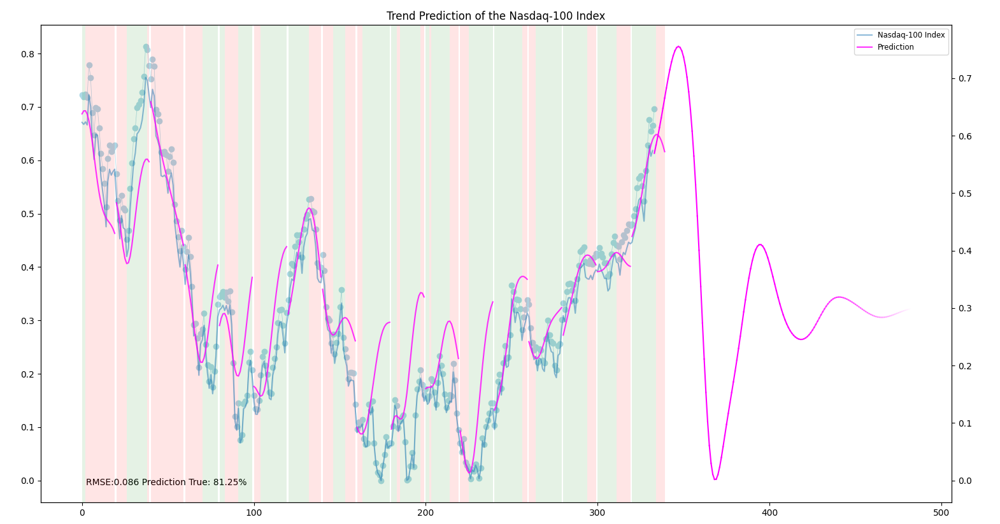

# NASDAQ 100 LSTM Model

This project implements an LSTM (Long Short-Term Memory) model for predicting the future trends of the NASDAQ 100 index. The model is trained using different combinations of hyperparameters to find the best configuration for accurate predictions.

## What is LSTM ?

The LSTM (Long Short-Term Memory) is a type of recurrent neural network (RNN) architecture that is well-suited for sequence prediction tasks, such as time series forecasting. It addresses the limitations of traditional RNNs by introducing specialized memory cells that can selectively store and retrieve information over long periods of time. LSTMs are particularly effective when dealing with sequences that exhibit long-term dependencies and complex patterns.

In your code, the LSTM model is used for predicting stock prices in the NASDAQ 100 index. Let's dive into the key components and parameters of the LSTM model:

### LSTM Layers

The LSTM model consists of one or more LSTM layers. Each layer contains multiple LSTM units, also known as memory cells. These cells have the ability to retain and utilize information over extended sequences, allowing the model to capture long-term dependencies. The number of LSTM layers is controlled by the `lstm_layers` parameter in the configuration file.

### Neurons per LSTM Layer

The `neurons_per_lstm_layer` parameter determines the number of neurons (memory cells) in each LSTM layer. Increasing the number of neurons can enhance the model's capacity to capture complex patterns, but it also increases the computational requirements. The range of `neurons_per_lstm_layer` is specified in the configuration file, allowing you to experiment with different values.

### Input Shape

The input shape of the LSTM layers is determined by the `input_timesteps` and `input_dim` parameters. `input_timesteps` corresponds to the number of time steps in each input sequence, while `input_dim` represents the number of features or variables included in the input data. The input shape is defined as `(input_timesteps, input_dim)`.

### Return Sequences

The `return_seq` parameter specifies whether the LSTM layers should return sequences or only the final output. When set to `True`, the LSTM layers return the entire sequence of outputs, which is useful when stacking multiple LSTM layers together. The LSTM layers are configured to return sequences by setting `return_seq` to `True` in the configuration file.

### Dropout

Dropout is a regularization technique used to prevent overfitting in neural networks. It randomly sets a fraction of input units to 0 during training, which helps to reduce the model's reliance on specific features and improves its generalization ability. A dropout layer is inserted after each LSTM layer with a dropout rate.

### Dense Layer

The final layer of the LSTM model is a dense layer with a linear activation function. This layer maps the output of the preceding LSTM layers to a single output value, representing the predicted stock price. 

### Model Compilation

Before training the LSTM model, it needs to be compiled by specifying the loss function and optimizer. In your code, the mean squared error (`mse`) is used as the loss function, which measures the discrepancy between the predicted and actual values. The Adam optimizer is chosen for updating the model's weights during training.

By varying the hyperparameters such as the number of LSTM layers, neurons per layer, and training configurations, you can experiment with different combinations to find the optimal LSTM model for predicting stock prices in the NASDAQ 100 index.

Please note that this explanation assumes some familiarity with deep learning concepts. If you need further clarification or have specific questions about any part of the LSTM implementation, feel free to ask!

## Code Files

- `run.py`: This script is the main entry point of the program. It loads the configuration, prepares the data, trains the model with various hyperparameter combinations, and saves the results.
- `model.py`: This module defines the `Model` class, which handles the building, training, and prediction of the LSTM model.
- `data_processor.py`: This module contains the `DataLoader` class, responsible for loading and preprocessing the data.
- `config.json`: This JSON file contains the configuration parameters for data processing, training, and model architecture.

## Usage

1. Make sure you have the required dependencies installed. You can install them by running the following command: `pip install -r requirements.txt`.
2. Place your data file named `nasdaq100.csv` in the `data` directory.
3. Adjust the hyperparameter ranges and other settings in the `config.json` file if needed.
4. Run the code using the command: `python run.py`.
5. The program will train the LSTM model with different hyperparameter combinations and save the results in the `saved_models` directory.
6. The final model properties will be saved in a JSON file named `model_properties.json`, which includes the RMSE (Root Mean Squared Error) and trend prediction accuracy for each model configuration.

## Model Architecture

The LSTM model architecture is defined in the `model.py` file. It consists of the following layers:

1. LSTM Layers: The number of LSTM layers can be configured in the `config.json` file. Each LSTM layer has a specified number of neurons, input timesteps, and input dimensions.
2. Dropout Layers: A dropout layer is added after each LSTM layer to prevent overfitting. The dropout rate can be adjusted in the `config.json` file.
3. Hidden LSTM Layers: This layer is added to stack multiple LSTM layers together, improving the model's capacity to capture complex patterns.
4. Dense Layer: A dense layer with linear activation is added as the output layer, predicting a single value.

## Hyperparameters

The `config.json` file allows you to specify various hyperparameters for data processing, training, and model architecture. Here are the explanations of some important hyperparameters used in the LSTM model:

- `epochs`: The range of epochs to train the model for. The training process will iterate over this range, evaluating each configuration.
- `batch_size`: The range of batch sizes to use during training. Different batch sizes will affect the learning dynamics and training time.
- `neurons_per_lstm_layer`: The range of the number of neurons in each LSTM layer. Higher numbers can increase the model's capacity to capture complex patterns but may also lead to overfitting.
- `lstm_layers`: The range of the number of LSTM layers in the model. Increasing the number of LSTM layers can improve the model's ability to learn hierarchical representations.

## Results

After running the code, the program will generate a `model_properties.json` file in the `saved_models` directory. This file contains the properties of each trained model configuration, including the RMSE (Root Mean Squared Error) and trend prediction accuracy. You can analyze these results to find the best hyperparameter combination for your prediction task.

Additionally, the program generates plots showing the true data, predicted data, and price evolution for each model configuration. These plots can be useful for visualizing the model's performance.

Feel free to adjust the hyperparameters

## Disclaimer
Please note that the code provided in this repository is intended for educational and learning purposes only. It should not be used as a basis for making investment decisions or as financial advice. The predictions generated by the LSTM model may not accurately reflect future stock prices or market behavior.

Investing in the stock market involves inherent risks, and past performance is not indicative of future results. It is important to conduct thorough research, consult with a qualified financial advisor, and carefully consider your investment objectives, risk tolerance, and financial situation before making any investment decisions.